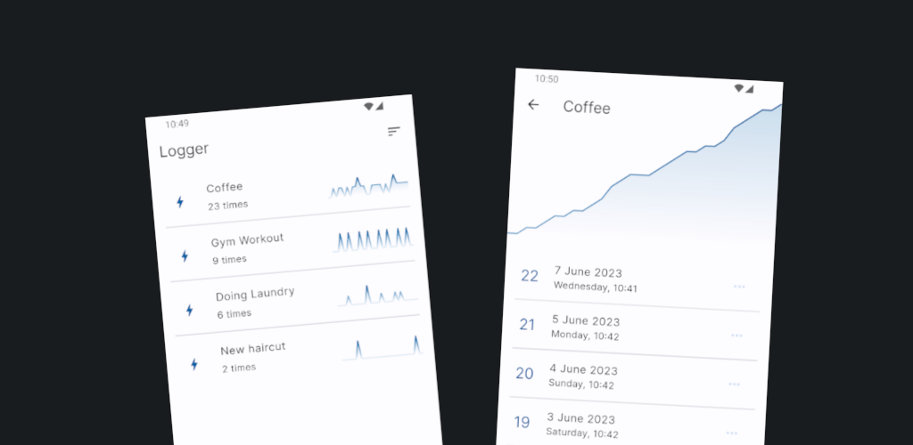

# Logger

Simple Flutter application for logging your life.
\
Live preview: [https://logger.mlukawski.com/](https://logger.mlukawski.com/)

## Features

- Data charts:
  - Activity over the last two weeks
  - Items increase over the last month
- Many list sorting options
- Responsive design
- Light / dark theme support
- Date and time picker for adding items

## License

This project is licensed under the GNU General Public License.
\
Please see the [license file](LICENSE) for more information.
